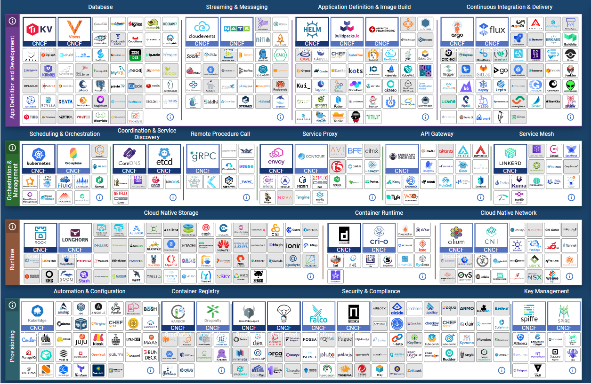

# 2022년 쿠버네티스 표준 아키택처 

## 표준 아키택처 선정 배경
2022년 쿠버네티스를 보다 완전하게 구성하기 위한 많은 제품들이 나와 있지만, 역설적으로 이미 너무 많은 제품이 있기 때문에 오히려 선정하는데 어려움이 있습니다. 

[그림 1] **2022년 1월 13일을 기준으로 CNCF에서 제공하는 제품들**

이에 시장에서 가장 안정적이고, 시행착오를 줄이기 위해 표준적인 아키택처가 있어야 한다고 판단되어 다음과 같이 선정하게 되었습니다. 일부는 이미 디 팩토(de facto / 사실 상) 표준이 경우도 있지만, 상황에 따라서는 한국 시장에 맞게 선정한 제품도 있습니다. 
예를 들면,  헬름, 아르고CD, 하버, kubeflow, 도커, 프로메테우스등은 선택을 고민할 필요가 없을 수준이지만, 그 외에는 비지니스 성격에 따라 다소 변경될 수도 있습니다.  
하지만 만약 Best Practice적인 성격으로 2022년에 구성을 고민하신다면, 현재의 [쿠버네티스 표준 구성](2022-k8s-stnd-arch.pdf)이 큰 도움이 될 것이라고 생각합니다. 부디 이를 통해서 금년도 쿠버네티스로의 진입이 더욱 더 수월하셨으면 합니다. 

[조 훈](https://github.com/sysnet4admin), [심근우](https://github.com/gnu-gnu), [문성주](https://github.com/seongjumoon) 드림

---

## 각 구성 요소 설명

### 멀티 클러스터 매니지먼트
**[Cluster API](https://cluster-api.sigs.k8s.io/)  **
하나의 CLI 도구로 AWS, Azure GCP와 같은 퍼블릭 클라우드, Openstack, Vsphere와 같은 프라이빗 클라우드 플랫폼에서 다수의 쿠버네티스 클러스터를 프로비저닝하고 관리할 수 있는 도구입니다. clusterctl을 통해서 클러스터 관리가 가능하며, 배포한 클러스터의 kubeconfig도 명령어로 내려받을 수 있습니다.

### 사용성 간편화 도구
**[헬름(Helm)](https://helm.sh/ko/) : 배포 간편화 도구  **
쿠버네티스 패키지 매니저로서 차트(Chart)를 통해서 쿠버네티스 클러스터에 컨테이너 애플리케이션을 손쉽게 배포할 수 있도록 도와주는 도구입니다. values에 정의한 다양한 파라미터를 통해서 원하는 옵션의 애플리케이션 커스터마이징도 가능하다는 장점이 있습니다. 

**[렌즈(Lens)](https://k8slens.dev/) : 쿠버네티스 통합 개발 환경(IDE) 도구  **
Lens 쿠버네티스를 활용하는 사람들이 많이 사용하는 GUI 도구입니다. 간단하게 클러스터의 컨텍스트를 변경하는 것부터 주로 디플로이먼트, 스테이트풀셋, 서비스, 컨피그맵, 시크릿과 같은 쿠버네티스 오브젝트를 손쉽게 확인하고 만약 변경이 필요한 부분이 있다면, 확인하던 UI에서 수정 버튼을 통해서 UI에서 변경이 가능하다는 장점이 있습니다. 추가로 배포되어있는 Pod에 Attach하여 셸 명령을 입력하거나,  파드의 로그를 실시간으로 조회할 수 있는 기능도 존재합니다.

### API 서버 로드밸런서 
**[HAPROXY](http://www.haproxy.org/)  **
쿠버네티스를 사용하기 이전부터 오픈소스 L7 로드밸런서로서 점유율이 높았으며, 컨트롤 플레인 내부에 마스터 노드들 위에 배포 되어 있는 여러 쿠버 API 서버로 로드밸런싱하기 위해서 사용합니다. 헬스 체크를 지원함으로써 단일 장애점 문제를 해소하는데 도움이 되는 기능이 존재합니다. 

### 네트워크 구현체
**[칼리코(Calico)](https://www.tigera.io/project-calico/) : 컨테이너 네트워크 인터페이스(CNI)  **
CNI 중에 가장 쉽고 빠르게 적용할 수 있으며, 사용자 층 또한 두껍습니다. 특히 현재 데이터센터에서 가장 인기 있는 BGP 프로토콜을 잘 지원하고 있으며, 성능 또한 상단에 위치하고 있습니다. 

**[MetalLB](https://metallb.universe.tf/) : 쿠버네티스 로드밸런서  **
쿠버네티스에서 로드밸런서를 구현체를 따로 만들지 않아도, 서비스로서 로드밸런서를 가장 먼저 사용할 수 있도록 해준 프로젝트입니다. 따라서 가장 오래되고 성숙된 제품 중에 하나입니다. L2, L3모드를 모두 지원합니다. 

**[Nginx Ingress](https://kubernetes.github.io/ingress-nginx/) : 쿠버네티스 인그레스  **
쿠버네티스 구성 시 가장 빠르고 간편하게 설치할 수 있는 인그레스 컨트롤러로서, 클러스터 외부에서 들어오는 요청을 URL 기반으로 처리할 수 있는 장점이 있습니다. 또한 애너테이션을 활용해 다양한 옵션을 부여하여, 리다이렉트 및 https 인증서 적용 등의 작업을 처리할 수 있습니다.

### 서비스 메시
**[이스티오(Istio)](https://istio.io/)  **
이스티오는 서비스 매쉬 도구로서 트래픽 관리, 옵저버빌리티와 같은 기능을 제공합니다. istioctl을 통해 간편하게 설치할 수 있으며, CRD를 통해서도 설치가 가능하다는 장점이 있습니다. VirtualService와 Gateway를 통해 인그레스 트래픽을 처리할 수 있으며, 중간에 filter를 활용해서 트래픽 제어가 가능합니다. 같이 배포되는 kiali라는 대시보드를 통해 서비스 트래픽 플로우를 웹 UI로 확인할 수 있습니다.

### 지속적 통합/배포(CI/CD) 도구 
**[Github Actions](https://github.com/features/actions) : CI  **
Github Actions 는 세계에서 가장 유명한 소스 코드 저장소인 Github 에서 제공하는 CI 도구입니다. Github 저장소에 보관된 소스를 바로 빌드할 수 있는 workflow를 구성할 수 있어 활용도가 높습니다. 또한 사전 구성된 workflow를 다양하게 제공하고 있습니다. Github 공개 저장소에서는 무료로 사용할 수 있으며, Github 비공개 저장소에 대해서 매월 2,000분 동안 빌드 시간을 무료로 구동할 수 있습니다.

**[Jenkins](https://www.jenkins.io/) : CI/CD  **
젠킨스는 지속적 통합 및 배포 단계에서 가장 널리 쓰이는 오픈소스입니다. 방대한 커뮤니티에서 제공하는 다양한 플러그인으로 인해 거의 모든 언어 및 도구와 연계할 수 있습니다. 젠킨스 설치를 위한 차트 및 젠킨스에서 사용할 수 있는 쿠버네티스 플러그인도 제공하고 있어 쿠버네티스 상에서 쉽게 사용할 수 있습니다.

**[깃랩(Gitlab)](https://about.gitlab.com/) : CI/CD  **
Gitlab CI/CD는 오픈소스 및 SaaS 소스코드 저장소인 Gitlab에서 사용할 수 있는 CI/CD 기능입니다. 무료 사용이 제한적인 Github Actions와 달리 무료로 사용할 수 있는 설치형 오픈소스 버전에서도 CI/CD 기능을 사용할 수 있습니다. Github Actions가 CI에 집중하는 것과 달리 pipeline 기능을 통해 CI/CD를 함께 구성할 수 있으며, Auto DevOps 기능을 통해 빌드, 테스트, 배포, 보안점검 기능 등을 한꺼번에 수행할 수 있습니다. 또한 Auto Monotoring 기능을 통해 배포된 애플리케이션의 모니터링까지 수행할 수 있어 CI/CD를 넘어서 DevOps 도구로서의 기능까지 충실하게 수행할 수 있습니다.

**[아르고CD(ArgoCD)](https://argo-cd.readthedocs.io/en/stable/) : CD  **
ArgoCD는 git을 배포의 원천으로 사용하는 GitOps CD 도구입니다. Git에 작성된 매니페스트 기반으로 쿠버네티스의 리소스 상태를 일치시키므로 선언적인 리소스 관리가 가능합니다. 소스 코드를 원천으로 애플리케이션만을 배포하는 것과 달리 선언적인 리소스를 배포하므로 배포된 리소스 전체의 상태에 대한 일관성 있는 관리가 가능합니다.

### 컨테이너 레지스트리
**[하버(Harbor)](https://goharbor.io/)  **
시장에서 가장 많은 점유율을 가지고 있는 컨테이너 레지스트리이며, private docker registry나 cloud provider registery로 부터 동기화도 손쉽게 동기화할 수 있습니다. 또한 하버 자체를 관리할 수 있는 API를 통해서 자동화도 쉽게 구성 가능한 장점이 있습니다. 추가로 번들(플러그인)으로 이미지 스캐너인(trivy)나 차트 저장소(chartmuseum)도 같이 구성하여 컨테이너 인프라 에서 요구하는 것에 대한 모든 저장소를 통합할 수 있습니다.

### 컨테이너 네이티브 스토리지
**[Rook](https://rook.io/) + [ceph](https://ceph.io/en/) : 컨테이너 네이티브 스토리지 오케스트레이션과 오브젝트 스토리지  **
Rook은 쿠버네티스 상에서 스토리지를 쓸 수 있도록 도와주는 컨테이너 네이티브 스토리지 오케스트레이션 솔루션입니다. Rook을 ceph과 함께 이용하면 ceph의 설치를 위해 복잡한 과정을 거치지 않고 CRD를 이용하여 쿠버네티스상에 ceph 클러스터를 간편하게 구성할 수 있으며 Rook + ceph가 지원하는 CSI를 통해 쿠버네티스의 볼륨을 쉽게 사용할 수 있습니다.

**[Velero](https://velero.io/) : 클러스터 데이터 관리 도구  **
쿠버네티스 클러스터의 리소스와 관련된 데이터와 볼륨을 관리할 수 있는 도구입니다. Velero를 통해 클러스터 상태 데이터 및 볼륨 스냅샷을 남길 수 있으며, 이를 오브젝트 스토리지와 연계하여 백업 및 복원할 수 있습니다. 이 기능을 통해서 클러스터의 장애 복구, 클러스터 환경의 마이그레이션(Migration) 시 유용하게 사용할 수 있습니다.

### MLOps 도구 
**[Kubeflow](https://www.kubeflow.org/)  **
데이터 사이언티스트 및 엔지니어의 협업을 쿠버네티스 클러스터 위에 배포된 주피터 노트북에서 작업을 공유할 수 있으며, 머신러닝 모델의 학습 시 필요한 하이퍼파라미터 튜닝을 할 수 있습니다. 또한 이렇게 만들어진 모델로 파이프라인을 구성할 수 있으며, 모델을 학습하기 위한 쿠버네티스 잡을 웹 UI에서 다룰 수 있습니다. 

### 서버리스(Serverless) 도구
**[Knative](https://knative.dev/docs/)  **
서버리스는 고정으로 배포된 서비스를 이용하지 않고, 요청이 있을 때마다 코드를 구동하고 중단하는 개념입니다. 쿠버네티스를 활용하여 이런 유연한 방식에 대한 활용성을 극대화할 수 있습니다. knative는 구글이 지원하고 있으며 레드햇, IBM 등이 채택하고 있어 인지도 및 활용도가 높습니다..

### 키 관리 서비스
**[Vault](https://www.vaultproject.io/)  **
Hashicorp에서 만든 오픈소스 키 관리 서비스로서, 데이터베이스 암호와 같은 민감한 정보를 시크릿에 바로 사람이 입력하는 것이 아니라, vault를 이용해 시크릿 데이터를 시스템에서 직접  통합하기 위한 목적으로 주로 사용합니다.  데이터베이스 암호 외에 타 서비스 간의 API 인증 토큰, 소프트웨어 라이선스 키와 같은 민감한 데이터를 yaml로서 바로 kubectl 명령어가 아닌 공용 시크릿 백엔드로부터 동기화하기 위해서 사용합니다. 또한 사용자의 편의에 따라서 CLI,HTTP REST API, WEB UI에서도 손쉽게 데이터를 확인 및 저장할 수 있습니다.

### 컨테이너 관리도구
**[도커(Docker)](https://www.docker.com/)  **
오래 전부터 사용하던 컨테이너 도구로 현재도 가장 큰 사용자를 가지고 있습니다. 또한 쿠버네티스가 dockershim과 연계를 중단한 것과 별개로 컨테이너 관리 도구로는 계속 사용 가능합니다. 또한 2014년부터 사용된 검증된 컨테이너 관리 도구로서, 매우 높은 안정성을 가지고 있습니다. 도커는 ContainerD를 컨테이너 런타임 인터페이스(CRI)로 포함하고 있습니다. 

### 로그 파이프라인
**[Fluentbit](https://fluentbit.io/) : 로그 포워더  **
Fluentbit은 오픈소스 로그 포워더입니다. 적은 자원 소비로도 높은 성능을 안정적으로 낼 수 있다는 것을 주된 장점으로 내세우고 있습니다. 쿠버네티스의 로그를 로그 수집 서비스에 전송하기 위하여 fluentbit INPUT 플러그인을 통해 로그 내용을 입력하여 다른 서비스로 전송하는데 쓸 수 있습니다.

**[엘라스틱서치(Elasticsearch)](https://www.elastic.co/kr/elasticsearch/) : 로그 보관 및 검색엔진  **
엘라스틱서치는 시장에서 각광받는 로그 보관 및 검색엔진 툴로 아파치 루씬 기반의 풀 텍스트 검색 기능을 제공합니다. 또한 REST API를 통해서 적재되어 있는 이벤트(로그)를 검색할 수 있습니다.

**[키바나(Kibana)](https://www.elastic.co/kr/kibana/) : 로그 및 데이터 시각화 대시보드  **
엘라스틱서치의 데이터를 시각화하는데 사용할 수 있는 대시보드입니다. 기본적인 시각화 기능 이외에도 엘라스틱서치의 데이터를 찾을 때 사용할 수 있는 강력한 탐색 도구를 내장하고 있습니다.

### 메트릭 파이프라인
**[프로메테우스(Prometheus)](https://prometheus.io/) : 메트릭 수집 및 조회  **
쿠버네티스 모니터링에 있어서 높은 점유율을 보여주고 있고, CNCF 재단에서 2번째 graduate project 이며, 여러 CNCF 및 오픈소스 프로젝트들이 메트릭을 prometheus 형식에 맞게 공개(export)하고 있습니다. 프로메테우스는 각 애플리케이션이 공개하는 데이터를 수집해오며, 수집된 데이터는 그라파나와 내장되어 있는 브라우저를 통해서 확인할 수 있습니다.

**[그라파나(Grafana)](https://grafana.com/) : 데이터 시각화 도구  **
시장에서 점유율이 높은 데이터 시각화 도구 중에 하나이며, 프로메테우스, 엘라스틱서치, 로키 심지어 포스트그레스큐엘과 같은 여러 데이터베이스로부터 데이터를 가져와 이를 사용자가 쉽게 확인할 수 있도록 도와주는 도구입니다. 조직에서 쉽게 사용자를 등록할 수 있도록, LDAP, OIDC, SAML 연동이 가능한 특징이 있습니다.

### 클러스터 프로비저너
**[kubeadm](https://kubernetes.io/ko/docs/setup/production-environment/tools/kubeadm/install-kubeadm/)  **
쿠버네티스에서 가장 많이 사용하는 클러스터 프로비저닝 CLI 도구로서, 간단한 명령어로 컨트롤 플레인을 프로비저닝하고, 다수의 워커 노드를 컨트롤 플레인 API 서버로 참여하도록 설정할 수 있습니다. 단순히 kubeadm 명령줄을 길게 나열해서 배포하는 것 이외에도 yaml 형식의 설정파일을 이용하여서 클러스터를 프로비저닝할 수 있습니다.

**[kubespray](https://kubernetes.io/ko/docs/setup/production-environment/tools/kubespray/)  **
앤서블 플레이북을 이용해서 쿠버네티스 클러스터를 프로비저닝할 수 있습니다. kubeadm 대비 여러개의 마스터노드를 설정해야할 때, 한번의 설정으로 클러스터의 컨트롤 플레인 및 워커 노드를 구성할 수 있다는 장점이 있습니다.

---

## 표준 아키택처를 기반으로 작성된 책 

### 도서 구입 안내
본 도서는 각 온오프라인 서점에서 만나보실 수 있습니다.
- 📍  [YES24](https://bit.ly/3iq4L5W)
- 📍  [알라딘](https://bit.ly/3cpo37M)
- 📍  [교보문고](https://bit.ly/3g1dsC7)

