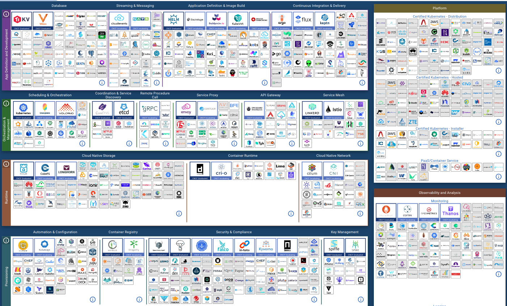
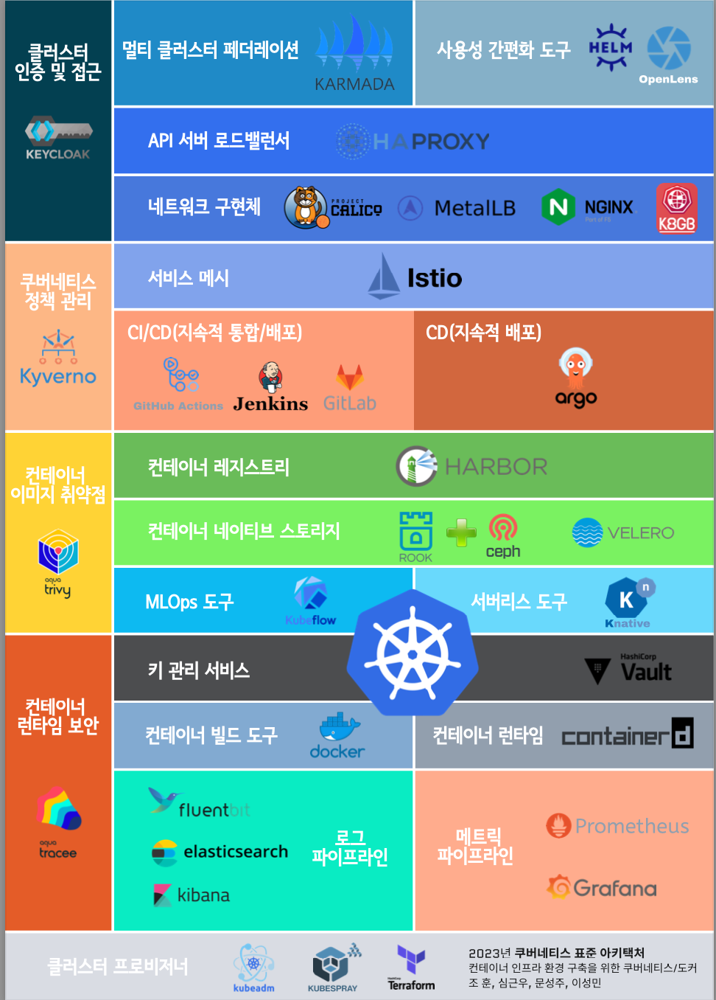

# 2023년 쿠버네티스 표준 아키텍처 

## 표준 아키텍처 선정 배경
2023년 쿠버네티스를 보다 원할하게 사용하기 위한 많은 제품들이 나와 있지만, 역설적으로 너무 많은 제품들이 있기 때문에 오히려 선정하기 어려움이 있습니다.   

[그림 1] **2022년 11월 21일을 기준으로 CNCF에서 제공하는 제품들**

이에 시장에서 많은 레퍼런스를 가지고 있고, 안정적으로 동작하는 제품들로 구성된 표준 아키텍처가 있어야 한다고 판단하였습니다.  
그렇지만 만약 이미 잘 쓰고 있는 구성 및 제품들이 있다면, **지금 구성된 제품들이 비지니스에 맞는 최적의 구성**입니다.  
 
다음의 선정한 제품들은 쿠버네티스를 시작하는 분들은 위한 가이드 또는 새로운 영역을 구성 추가할 때 참고할 수 있는 내용이라고 이해해 주시면 좋겠습니다.  
일부는 이미 디 팩토(de facto / 사실상 표준)인 경우도 있지만, 상황에 따라서는 한국 시장에 맞게 선정한 제품도 있습니다. 예를 들면,  헬름, 아르고CD, 하버, Kubeflow, 도커, 프로메테우스등은 선택을 고민할 필요가 없을 수준이지만, 그 외에는 비즈니스 성격에 따라 다소 변경될 수도 있습니다.  
2023년 Best Practice적인 성격으로 쿠버네티스 구성을 고민하신다면, [현재의 구성](2023-k8s-stnd-arch.pdf)이 큰 도움이 될 것이라고 생각합니다.  

 
[그림 2] **2023년 쿠버네티스 표준 구성** ([pdf 원본](2023-k8s-stnd-arch.pdf))

부디 이를 통해서 금년도 쿠버네티스로의 진입이 더욱 더 수월하셨으면 합니다.

[조 훈](https://github.com/sysnet4admin), [심근우](https://github.com/gnu-gnu), [문성주](https://github.com/seongjumoon), [이성민](https://github.com/dmxlsj) 드림

---

## 각 구성 요소 설명

### 🎉 쿠버네티스 보안 추가 🎉
### 클러스터 인증 및 접근 
**[키클락(Keycloak)](https://www.keycloak.org/) : 클러스터 인증 및 접근 관리  **
키클락은 IAM(Identity and Access Management, 신원 인증 및 접근 관리)에 도구로 싱글사인온(Single Sign-On, SSO)을 허용하는 오픈소스 도구입니다. 인터넷을 통해 접근 가능한 곳에 배포된 쿠버네티스 API나 애플리케이션은 누구나 접근 가능하기 때문에 이런 경우에 키클락을 사용하면 구글 등 특정 IdP(Identity Provider, 신원 공급자)를 사용하여 인증 후에 접근 가능하도록 관리하는 것이 가능합니다. 또한 LDAP(Lightweight Directory Access Protocol)등을 사용하여 각 사용자의 권한을 단계별로 설정하는 등 클러스터 전체의 접근 권한을 쉽게 관리할 수 있습니다.

### 쿠버네티스 정책 관리 
**[키베노(Kyverno)](https://kyverno.io/) : 쿠버네티스 정책 관리 및 적용  **
쿠버네티스 클러스터 내부에서 수행할 수 있는 작업 범위나 허용 여부를 결정하기 위해 정의된 규칙을 정책(Policy)이라고 합니다. Kyverno는 정책을 관리하고 쿠버네티스 클러스터에 적용하는 도구입니다.  Kyverno를 통해 이미지의 특정 태그 제한, 호스트의 포트 사용 제한, 사용할 수 있는 이미지 레지스트리 제한 등을 설정할 수 있으며, 적용할 수 있는 정책은 매우 다양합니다. Kyverno 이외에도 OPA(Open Policy Agent) 등과 같은 정책과 관련된 도구가 있습니다만, 정책 적용을 위한 별도의 특화된 문법을 공부해야 하는 단점이 있습니다. Kyverno는 기본적인 쿠버네티스 YAML 문법을 그대로 활용하여 사용자에게 친숙하며, 홈페이지에서 참고하여 쓸 수 있는 수 많은 예시를 제공하고 있어 편리합니다.

### 컨테이너 이미지 취약점 
**[트리비(Trivy)](https://github.com/aquasecurity/trivy) : 컨테이너 이미지 취약점 검증  **
대표적인 컨테이너 이미지 취약점 검증 도구이며 취약점 검증 이외에 도커(Docker), 테라폼(Terraform)등에 대한 파일 검증도 수행이 가능합니다. NSA(National Security Agency)와  FIPS(Federal Information Processing Standards)등의 기준에 맞게 보안 검증을 진행합니다. 특히 사용법이 쉽고 간단하여 가장 널리 사용되는 취약점 검증 도구입니다. 

### 컨테이너 런타임 보안 
**[트레이시(Tracee)](https://github.com/aquasecurity/tracee) : 컨테이너 런타임 보안 **
컨테이너 런타임에 대해서 이상 행위를 탐지하거나 추적하기 위해서 사용하는 보안 도구로서 리눅스 커널의 eBPF(Extended Berkeley Packet Filter)를 사용하여, 호스트 OS 및 애플리케이션을 추적하여 이벤트를 분석해 의심스러운 행위를 찾을 수 있습니다.  이 이벤트가 의심스러운지 판단하는 규칙을 시그니처라고 하며, 이 시그니처는 Rego, Go-Cel, Golang SDK를 통해서 작성할 수 있습니다. Tracee는 쿠버네티스에서 데몬셋으로 구성할 수 있으며, 호스트 OS에서는 Tracee를 직접 설치해서 사용할 수 있습니다.

---

### 멀티 클러스터 페더레이션
**[카마다(Karmada)](https://karmada.io/)  **
Karmada는 Kubernetes Federation (v1)과 KubeFed (v2)의 명맥을 잇는 동시에 현재 KubeFed가 갖고 있는 확장성과 API 통일성 문제를 해결하기 위해 시작된 오픈소스입니다. On-prem뿐 아니라 다양한 프로바이더의 클러스터를 혼재하여 등록/관리 할 수 있고 다수의 클러스터들에 동시 배포가 가능할 뿐 만 아니라 Istio등의 서비스 메시와 함께 사용하여 각 클러스터에 트래픽을 분배하는 것도 가능합니다.
Cluster-API는 직접 PaaS를 운영하는 주체가 아니라면 매우 제한적으로 사용되고 있어, 2023년 표준 아키텍처에는 포함하지 않았습니다.

### 사용성 간편화 도구
**[헬름(Helm)](https://helm.sh/ko/) : 배포 간편화 도구  **
쿠버네티스 패키지 매니저로서 차트(Chart)를 통해서 쿠버네티스 클러스터에 컨테이너 애플리케이션을 손쉽게 배포할 수 있도록 도와주는 도구입니다. values에 정의한 다양한 파라미터를 통해서 원하는 옵션의 애플리케이션 커스터마이징도 가능하다는 장점이 있습니다. 

**[오픈렌즈(OpenLens)](https://github.com/lensapp/lens) : 쿠버네티스 통합 개발 환경(IDE) 도구  **
가장 널리 사용되는 쿠버네티스 관리를 위한 GUI 도구인 Lens가 버전6 부터 구독형으로 라이선스가 변경되었습니다. 이에 기존의 Lens는 OpenLens로 이름이 변경되고 또한 오픈소스 프로젝트 형태로 변경되었습니다. OpenLens를 통해 클러스터와 노드 뿐만 아니라 쿠버네티스 오브젝트인 디플로이먼트, 스테이트풀셋, 파드, 서비스, 컨피그맵 그리고 시크릿등과 같은 리소스를 기존에 Lens와 거의 동일한 형태로 확인하고 관리할 수 있습니다. 또한 파드에 Attach 하여 셸을 여는 기능이나 포트포워딩을 하는 등의 편의 기능 또한 OpenLens 상에서 수행할 수 있어 매우 편리합니다.

### API 서버 로드밸런서 
**[HAPROXY](http://www.haproxy.org/)  **
쿠버네티스를 사용하기 이전부터 오픈소스 L7 로드밸런서로서 점유율이 높았으며, 컨트롤 플레인 내부에 마스터 노드들 위에 배포 되어 있는 여러 쿠버 API 서버로 로드밸런싱하기 위해서 사용합니다. 헬스 체크를 지원함으로써 단일 장애점 문제를 해소하는데 도움이 되는 기능이 존재합니다. 

### 네트워크 구현체
**[칼리코(Calico)](https://www.tigera.io/project-calico/) : 컨테이너 네트워크 인터페이스(CNI)  **
CNI 중에 가장 쉽고 빠르게 적용할 수 있으며, 사용자 층 또한 두껍습니다. 특히 현재 데이터센터에서 가장 인기 있는 BGP 프로토콜을 잘 지원하고 있으며, 성능 또한 상단에 위치하고 있습니다. 최근에는 eBPF 및 XDP 적용한 실리움을 통해서 네트워크 트래픽이 흐르는 가시성을 확보하면서, XDP를 통해서 네트워크 라우팅 성능을 개선할 수 있습니다. 실리움을 구성하게 되면 iptables, ipvs 와 같은 네트워킹 스택을 사용하는 것이 아닌 XDP를 사용하기 때문에 네트워크 구조를 추적하기에 어려운 문제가 있고, 또한 커널 버전의 변경이 필요하기 때문에 이와 같은 번거로운 작업없이 쉽게 구성할 수 있는 칼리코가  현재 시점에 더 유연하게 적용할 수 있습니다.

**[MetalLB](https://metallb.universe.tf/) : 쿠버네티스 로드밸런서  **
쿠버네티스에서 로드밸런서 서비스를 사용할 수 있도록 지원해 주는 제품입니다. 가장 오래되고 성숙된 제품 중에 하나이며 L2, L3(BGP)모드를 모두 지원합니다. v0.13.2부터는 CRD형태로 IP 풀(Pool), 모드 등을 간편하게 설정할 수 있도록 변경되었습니다. 

**[Nginx Ingress Controller](https://kubernetes.github.io/ingress-nginx/) : 쿠버네티스 인그레스  **
인그레스는 클러스터 외부에서 HTTP 및 HTTPS 를 통해 내부로 접속하는 URL 경로를 노출하는 오브젝트입니다. 인그레스를 관리하는 인그레스 컨트롤러는 다양한 구현체가 있으며, 그  중 Nginx를 기반으로 한 인그레스 컨트롤러가 가장 널리 쓰이고 있습니다. 현재 인그레스가 널리 쓰이고 있으나, 인그레스에 좀 더 다양한 기능을 추가하고, 사용하는 오브젝트의 관계를 좀 더 구조적으로 구성한 Gateway API 가 만들어지고 있습니다. 그렇지만 현재는 인그레스를 대체할 계획은 쿠버네티스 진영에는 보이지 않습니다.

**[k8gb](https://www.k8gb.io/) : 쿠버네티스 글로벌 로드밸런서  **
쿠버네티스 글로벌 로드밸런서는 GSLB(Global Server Load Balancing)를 참고하여 제작되었으며, 어느 쿠버네티스 지역에 있더라도 가능한 유사한 네트워크 트래픽을 받도록 구현하는 것을 목표로 하고 있습니다. 따라서 CSP(Cloud Service Provider, AWS/Azure/GCP/NCP) 또는 Karmada와 같은 멀티 클러스터 환경에서 하이브리드 클라우드를 위한  글로벌 네트워크 구성을 도와주는 제품 입니다. 

### 서비스 메시
**[이스티오(Istio)](https://istio.io/)  **
이스티오는 서비스 메시 도구로서 트래픽 관리, 옵저빌리티와 같은 기능을 제공합니다. istioctl을 통해 간편하게 설치할 수 있으며, CRD를 통해서도 설치가 가능하다는 장점이 있습니다. VirtualService와 Gateway를 통해 인그레스 트래픽을 처리할 수 있으며, 중간에 filter를 활용해서 트래픽 제어가 가능합니다. 같이 배포되는 Kiali 라는 대시보드를 통해 서비스 트래픽 흐름을 웹 UI로 확인할 수 있습니다. 
이스티오 사용 시 사이드카 패턴을 파드에 적용하여 엔보이(Envoy) 프록시가 붙기 때문에 CPU나 메모리  추가로 리소스를 사용한다는 우려가 있습니다. 최근 추가된 기능인 이스티오 엠비언트 메시(Ambient Mesh) 를 통해서 엔보이 프록시가 사이드카 패턴으로 파드에 붙는 구조가 아닌 노드에 ztunnel(제로 트러스트 터널)이라는 데몬을 통해서, 쿠버네티스 클러스터가 사용가능한 CPU와 메모리를 절감하면서 서비스 메시 구성이 가능합니다.

### 지속적 통합/배포(CI/CD) 도구 
**[Github Actions](https://github.com/features/actions) : CI/CD  **
Github Actions 는 세계에서 가장 유명한 소스 코드 저장소인 Github 에서 제공하는 CI/CD 도구입니다. Github 저장소에 보관된 소스를 바로 빌드/배포 할 수 있는 workflow들을 구성할 수 있어 활용도가 높습니다. Github 자체에서 제공하는 workflow 템플릿 뿐만 아니라 수 많은 오픈소스 템플릿들을 활용하여 파이프라인을 쉽고 간결하게 구성할 수 있다는 장점이 있습니다. Github에서 제공하는 runner를 사용할 경우 공개 저장소는 무료로 사용 가능하고, 비공개 저장소의 경우에는 월 2,000분까지 무료로 사용가능합니다.

**[젠킨스(Jenkins)](https://www.jenkins.io/) : CI/CD  **
젠킨스는 지속적 통합 및 배포 단계에서 가장 널리 쓰이는 오픈소스입니다. 방대한 커뮤니티에서 제공하는 다양한 플러그인으로 인해 거의 모든 언어 및 도구와 연계할 수 있습니다. 젠킨스 설치를 위한 차트 및 젠킨스에서 사용할 수 있는 쿠버네티스 플러그인도 제공하고 있어 쿠버네티스 상에서 쉽게 사용할 수 있습니다. 젠킨스 파이프라인을 사용하면 해당 CI/CD에 사용되는 스크립트를 프로젝트의 저장소에서 넣고 관리가 가능해 일련의 빌드 및 배포과정을 모두 코드로 쉽게 관리할 수 있습니다.

**[깃랩(Gitlab)](https://about.gitlab.com/) : CI/CD  **
Gitlab CI/CD는 오픈소스 및 SaaS 소스코드 저장소인 Gitlab에서 사용할 수 있는 CI/CD 기능입니다. 무료 사용이 제한적인 Github Actions와 달리 무료로 사용할 수 있는 설치형 오픈소스 버전에서도 CI/CD 기능을 사용할 수 있습니다. Github Actions가 CI에 집중하는 것과 달리 pipeline 기능을 통해 CI/CD를 함께 구성할 수 있으며, Auto DevOps 기능을 통해 빌드, 테스트, 배포, 보안점검 기능 등을 한꺼번에 수행할 수 있습니다. 또한 Auto Monitoring 기능을 통해 배포된 애플리케이션의 모니터링까지 수행할 수 있어 CI/CD를 넘어서 DevOps 도구로서의 기능까지 충실하게 수행할 수 있습니다.

**[아르고CD(ArgoCD)](https://argo-cd.readthedocs.io/en/stable/) : CD  **
ArgoCD는 git을 배포의 원천으로 사용하는 GitOps CD 도구입니다. Git에 작성된 매니페스트 기반으로 쿠버네티스의 리소스 상태를 일치시키므로 선언적인 리소스 관리가 가능하고, GitOps 특성상 애플리케이션 자체의 소스코드와 (CI) 배포에 해당되는 소스코드를 (CD) 별개로 관리하는 것이 일반적이기 때문에 배포 시 리소스나 런타임 설정만 변경할 경우 애플리케이션의 빌드 없이 빠르게 배포 및 롤백이 가능하다는 장점이 있습니다. 이 외에 Argo Rollouts이나 Argo CD Notifications등을 추가로 적용해 다양한 배포 전략을 사용하거나 배포 관련 알림을 설정 하는 등 좋은 확장성을 가지고 있습니다.

### 컨테이너 레지스트리
**[하버(Harbor)](https://goharbor.io/)  **
시장에서 가장 많은 점유율을 가지고 있는 컨테이너 레지스트리이며, Private Docker Registry나 Cloud Provider Registry로 부터 손쉽게 동기화할 수 있습니다. 또한 하버(Harbor) 자체를 관리할 수 있는 API를 통해서 자동화도 쉽게 구성이 가능한 장점이 있습니다. 추가 번들(플러그인)로 컨테이너 이미지의 취약점을 찾는 스캐너인 트리비(Trivy), 컨테이너 이미지 무결성을 보증하기 위한 서명을 위한 도구인 노터리(Notary)를 적용할 수 있습니다. 또한 차트 저장소인 차트뮤지엄(Chartmuseum)도 같이 구성하여 컨테이너 인프라에서 요구하는 것에 대한 모든 저장소를 통합할 수 있습니다.

### 컨테이너 네이티브 스토리지
**[Rook](https://rook.io/) + [Ceph](https://ceph.io/en/) : 컨테이너 네이티브 스토리지 오케스트레이션과 오브젝트 스토리지  **
Rook은 쿠버네티스 상에서 스토리지를 쓸 수 있도록 도와주는 컨테이너 네이티브 스토리지 오케스트레이션 솔루션입니다. 유사한 도구로 Longhorn이 있습니다. 두 도구는 기본적인 기능과 구조가 굉장히 유사하지만 Rook은 업계에서 가장 널리 사용되는 오픈소스 분산 스토리지 솔루션 Ceph와 함께 사용할 수 있어, 익숙함의 이점을 누릴 수 있습니다. 또한 블록스토리지만을 제공하는 Longhorn과 달리 Ceph를 사용하면 블록스토리지 뿐만 아니라 오브젝트 스토리지도 동시에 사용할 수 있습니다.

**[벨레로(Velero)](https://velero.io/) : 클러스터 데이터 관리 도구  **
쿠버네티스 클러스터의 리소스와 관련된 데이터와 볼륨을 관리할 수 있는 도구입니다. Velero를 통해 클러스터 상태 데이터 및 볼륨 스냅샷을 남길 수 있으며, 이를 오브젝트 스토리지와 연계하여 백업 및 복원할 수 있습니다. 이 기능을 통해서 클러스터의 장애 복구, 클러스터 환경의 마이그레이션(Migration) 시 유용하게 사용할 수 있습니다.

### MLOps 도구 
**[Kubeflow](https://www.kubeflow.org/)  **
데이터 사이언티스트 및 엔지니어의 협업을 쿠버네티스 클러스터 위에 배포된 주피터 노트북에서 작업을 공유할 수 있으며, 머신러닝 모델의 학습 시 필요한 하이퍼파라미터 튜닝을 할 수 있습니다. 또한 이렇게 만들어진 모델로 파이프라인을 구성할 수 있으며, 모델을 학습하기 위한 쿠버네티스 잡을 웹 UI에서 다룰 수 있습니다. 

### 서버리스(Serverless) 도구
**[Knative](https://knative.dev/docs/)  **
서버리스는 고정으로 배포된 서비스를 이용하지 않고, 요청이 있을 때마다 코드를 구동하고 중단하는 개념입니다. 쿠버네티스를 활용하여 이런 유연한 방식에 대한 활용성을 극대화할 수 있습니다. Knative는 구글이 지원하고 있으며 레드햇, IBM 등이 채택하고 있어 인지도 및 활용도가 높습니다.

### 키 관리 서비스
**[볼트(Vault)](https://www.vaultproject.io/)  **
Hashicorp에서 만든 오픈소스 키 관리 서비스로서, 데이터베이스 암호와 같은 민감한 정보를 시크릿에 바로 사람이 입력하는 것이 아니라, Vault를 이용해 시크릿 데이터를 시스템에서 직접  통합하기 위한 목적으로 주로 사용합니다. 데이터베이스 암호 외에 타 서비스 간의 API 인증 토큰, 소프트웨어 라이선스 키와 같은 민감한 데이터를 YAML로서 바로 kubectl 명령어가 아닌 공용 시크릿 백엔드로부터 동기화하기 위해서 사용합니다. 또한 사용자의 편의에 따라서 CLI, HTTP REST API, WEB UI에서도 손쉽게 데이터를 확인 및 저장할 수 있습니다.

### 컨테이너 관리도구
**[도커(Docker)](https://www.docker.com/): 컨테이너 빌드 도구  **
오래 전부터 사용하던 컨테이너 도구로 현재에도 가장 많은 사용자들이 이용하고 있습니다. 또한 쿠버네티스가 도커심(Dockershim)과 연계를 중단한 것과 별개로 컨테이너 빌드 도구로는 계속 사용 가능합니다. 또한 2014년부터 사용된 검증된 컨테이너 빌드 도구로서, 매우 높은 안정성을 가지고 있습니다. 컨테이너 빌드 도구 중에 Redhat에서 Podman이 있는데 이는 데몬이 없고, 루트 권한 없이 컨테이너를 생성할 수 있고 기존에 도커 명령과 동일하게 사용할 수 있다는 다양한 장점이 있지만, 현재에는 레퍼런스가 부족하고 사용자 층이 얇아 선택하지 않았습니다. 

**[컨테이너디(ContainerD)](https://containerd.io/): 컨테이너 런타임  **
쿠버네티스 버전 v1.24부터 도커심(Dockershim)을 더이상 사용할 수 없도록 제거(Removal여(된 상태이기 때문에, 컨테이너디(ContainerD)와 같은 컨테이너 런타임 도구를 사용해야 합니다. 컨테이너디 이외에 CRI-O도 있으나, 이는 구성이 다소 복잡하고 레퍼런스가 많지 않아 컨테이너디(ContainerD)로 구성하도록 선택 하였습니다. 현재 다양한 관리형 쿠버네티스 및 설치형 쿠버네티스에서 컨테이너디를 기본적인 컨테이너 런타임으로 구성하여 사용하고 있습니다. 

### 로그 파이프라인
**[Fluentbit](https://fluentbit.io/) : 로그 포워더  **
Fluentbit은 오픈소스 로그 포워더입니다. 적은 자원 소비로도 높은 성능을 안정적으로 낼 수 있다는 것을 주된 장점으로 내세우고 있습니다. 쿠버네티스의 로그를 로그 수집 서비스에 전송하기 위하여 Fluentbit INPUT 플러그인을 통해 로그 내용을 입력하여 다른 서비스로 전송하는데 쓸 수 있습니다. 최근에는 대량  로그 데이터를 전송할 때 데이터독에서 만든 벡터(Vector)를 사용할 수 있습니다. 벡터는 메트릭, 이벤트, 로그 등을 비롯해서 모니터링 데이터를 엘라스틱서치(Elasticsearch)로 전송할 때 CPU 성능에 맞게 메트릭이나 여러 데이터를 송신 처리량을 조절하는 ARC(Adaptive Request Concurrency) 기능을 제공하지만 Fluentbit 처럼 아직은 사용자 층이 두껍지 않아 선정하지 않았습니다.

**[엘라스틱서치(Elasticsearch)](https://www.elastic.co/kr/elasticsearch/) : 로그 보관 및 검색엔진  **
엘라스틱서치는 가장 널리 쓰이는 검색엔진 도구입니다. 비정형 데이터를 저장할 수 있으며, 아파치 루씬(Apache Lucene)을 기반으로 한 강력한 텍스트 검색 기능을 제공하고 있기 때문에 로그 및 이벤트를 저장하고 추후 검색하여 사용하는데 유용하게 사용할 수 있습니다.

**[키바나(Kibana)](https://www.elastic.co/kr/kibana/) : 로그 및 데이터 시각화 대시보드  **
엘라스틱서치의 데이터를 시각화하는데 사용할 수 있는 대시보드입니다. 다양한 시각화 기능 을 제공하고 있으며, 엘라스틱서치의 데이터를 찾을 때 사용할 수 있는 탐색 도구 또한 내장하고 있습니다.

### 메트릭 파이프라인
**[프로메테우스(Prometheus)](https://prometheus.io/) : 메트릭 수집 및 조회  **
쿠버네티스 모니터링에 있어서 높은 점유율을 보여주고 있고, CNCF에서 2번째 졸업(Graduated) 프로젝트이며, 여러 CNCF 및 오픈소스 프로젝트들이 메트릭을 프로메테우스(Prometheus) 형식에 맞게 공개하고 이를 프로메테우스가 수집하고 있습니다. 이렇게 프로메테우스 수집 저장된 메트릭 데이터는 그라파나(Grafana)와 내장되어 있는 브라우저를 통해서 확인할 수 있습니다.

**[그라파나(Grafana)](https://grafana.com/) : 메트릭(데이터) 시각화 도구  **
시장에서 점유율이 높은 데이터 시각화 도구 중에 하나이며, 프로메테우스, 엘라스틱서치(Elasticsearch), 로키(Loki) 심지어 포스트그레스큐엘(Postgresql)과 같은 여러 데이터베이스로부터 데이터를 가져와 이를 사용자가 쉽게 확인할 수 있도록 도와주는 도구입니다. 조직에서 쉽게 사용자를 등록할 수 있도록, LDAP, OIDC, SAML 연동이 가능한 특징이 있습니다.

### 클러스터 프로비저너
**[kubeadm](https://kubernetes.io/ko/docs/setup/production-environment/tools/kubeadm/install-kubeadm/)  **
쿠버네티스에서 가장 많이 사용하는 클러스터 프로비저닝 CLI 도구로서, 간단한 명령어로 컨트롤 플레인을 프로비저닝하고, 다수의 워커 노드를 컨트롤 플레인 API 서버로 참여하도록 설정할 수 있습니다. 단순히 kubeadm 명령줄을 길게 나열해서 배포하는 것 이외에도 YAML 형식의 설정파일을 이용하여서 클러스터를 프로비저닝할 수 있습니다.

**[kubespray](https://kubernetes.io/ko/docs/setup/production-environment/tools/kubespray/)  **
앤서블 플레이북을 이용해서 쿠버네티스 클러스터를 프로비저닝할 수 있습니다. kubeadm 대비 여러개의 마스터노드를 설정해야할 때, 한번의 설정으로 클러스터의 컨트롤 플레인 및 워커 노드를 구성할 수 있다는 장점이 있습니다.

**[테라폼(Terraform)](https://www.terraform.io/)  **
테라폼은 오픈소스 코드형 인프라(Infrasructure as Code, IaC) 관리 도구로 일련의 클라우드 인프라를 코드화 하여 관리할 수 있도록 도와줍니다. 각 클라우드에서 제공하는 프로바이더를 활용해 다양한 플랫폼에 대한 관리가 가능하며, 다른 오픈소스 모듈들을 활용해 여러 배포 스택을 효율적으로 관리할 수 있습니다. 이런 장점에 따라 현재 클라우드에 쿠버네티스를 배포할때 가장 많이 사용되는 쿠버네티스 클러스터 프로비저너로 사용되고 있습니다.

---

## 표준 아키텍처를 기반으로 작성된 책 

### 도서 구입 안내
본 도서는 각 온오프라인 서점에서 만나보실 수 있습니다.
- 📍  [YES24](https://bit.ly/3iq4L5W)
- 📍  [알라딘](https://bit.ly/3cpo37M)
- 📍  [교보문고](https://bit.ly/3g1dsC7)

