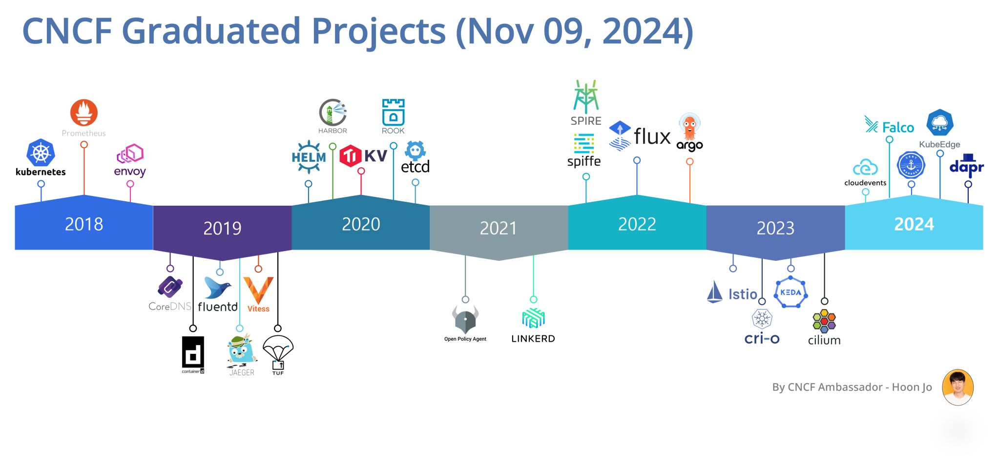
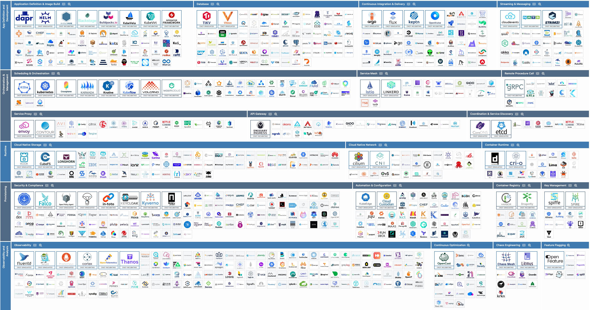
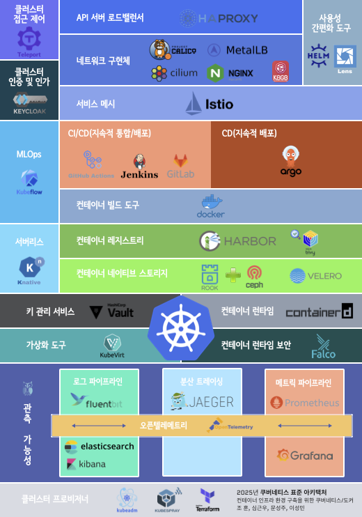

# 2025년 쿠버네티스 표준 아키텍처 

## 표준 아키텍처 선정 배경

2025년 쿠버네티스는 이제 완연하게 성숙한 프로젝트가 된 것 같습니다. 그리고 쿠버네티스와 밀접한 연관이 있는 클라우드 네이티브 컴퓨팅 재단(CNCF, Cloud Native Computing Foundation)에서도 성숙한 제품이라고 표현하는 졸업 프로젝트가 2024년 11월 09일 기준 총 29개가 발표되었습니다. 

[그림1] **시간대 별 CNCF의 졸업 프로젝트 (2024년 11월 09일 기준)**

 이러한 제품의 높은 성숙도에도 불구하고 여전히 쿠버네티스를 원할하게 사용하기 위해서는 많은 제품들을 이해하고 선택해야 합니다.   

[그림 2] **CNCF에서 제공하는 제품들 (2024년 12월 15일을 기준)**

 만약 관리형 쿠버네티스(EKS, AKS, GKE)를 사용한다고 해도, 위에 있는 제품들이 이미 사용하는 관리형 쿠버네티스에 내재화 되어 있는 경우가 있습니다. 혹은 내재화 되어 있지 않다고 해도 오픈 소스 형태를 다시 관리형 쿠버네티스에 직접 적용하는 사례가 많이 있기 때문에 쿠버네티스와 연관된 제품들에 대한 이해가 있다면, 이를 좀 더 유용한 형태로 사용할 수 있을 것입니다.   
그렇지만 여기서 중요한 부분은 만약 이미 잘 쓰고 있는 구성 및 제품들이 있다면, **지금 구성된 제품들이 비즈니스에 맞는 최적의 구성**이라는 것입니다. 또한 이와 같은 이유로 **표준**이라고 제목을 정하였으나, 사실상 현재 시장 상황에 맞는 제품 즉 트렌드에 가깝다는 것을 밝힙니다. 마지막으로 쿠버네티스를 안정적으로 그리고 편리하게 운영하고자 하는 목적을 달성하기 위해, 오픈 소스 외에도 다양한 제품들을 적극적으로 받아들였습니다.  
 
위와 같은 이유로 다음의 선정한 제품들은 쿠버네티스를 시작하는 분들을 위한 가이드 또는 새로운 형태를 구성 하고자할 때 적극적으로 참고할 수 있는 내용이라고 이해해 주시면 좋겠습니다.  
일부는 이미 디 팩토(de facto / 사실상 표준)인 경우도 있지만, 상황에 따라서는 한국 시장에 맞게 선정한 제품도 있습니다. 예를 들면,  헬름, 아르고CD, 하버, 프로메테우스 그리고 그라파나등은 선택을 고민할 필요가 없을 수준이지만, 그 외에는 비즈니스 성격에 따라 다소 변경될 수도 있습니다.  
2025년 쿠버네티스를 조합하는 방법 그리고 나아가야 하는 방법에 대해서 고민하신다면, [현재의 구성](2025-k8s-stnd-arch.pdf)이 큰 도움이 될 것이라고 생각합니다.  

 
[그림 3] **2025년 쿠버네티스 표준 구성** ([pdf 원본](2025-k8s-stnd-arch.pdf))

부디 이를 통해서 금년도 쿠버네티스로의 진입 또는 활성화가 더욱 더 수월하셨으면 합니다.

[조 훈](https://github.com/sysnet4admin), [심근우](https://github.com/gnu-gnu), [문성주](https://github.com/seongjumoon), [이성민](https://github.com/sungmincs) 드림

---
🗑 삭제  🗑
### 쿠버네티스 정책 관리
**[키베르노(Kyverno)](https://github.com/kyverno/kyverno), 깃허브스타 5.8k, 라이선스 Apache License 2.0  **
쿠버네티스 클러스터 내부에서 수행할 수 있는 작업 범위나 허용 여부를 결정하기 위해 정의된 규칙을 생성하는 도구였으나, 쿠버네티스 v1.30에서 부터 admission control을 직접 지원할 수 있도록 하는 기능이 GA(General Availability, 안정화됨) 되었기 때문에 표준 구성에서는 큰 의미를 가지지 못하게 되었습니다. 물론 여전히 외부적인 정책을 적용할 수 있는 웹훅(WebHook)으로는 특히 뮤테이션(Mutation)의 경우에는 유용한 도구입니다. 이와 같은 변화에 대해서는 2024년 말에 KubeCon 인도에 발표한 영상 및 자료를 참고하실 수 있습니다.

### 컨테이너 이미지 취약점 
**[트리비(Trivy)](https://github.com/aquasecurity/trivy), 깃허브스타 24k, 라이선스: Apache License 2.0  **
대표적인 컨테이너 이미지 취약점 검증 도구이긴 하나, 하버를 구성할 때 트리비의 구성 여부를 선택할 수 있습니다. 특히 이미지 취약점을 점검하기에 가장 좋은 시기는 이미지가 업로드되는 시기이므로 트리비를 단독으로 사용하는 것보다 하버와 같이 사용하는 것이 구조적으로 가장 좋다고 판단하였습니다. 
하지만 CNAPP등을 위한 다른 도구를 사용하는 경우 불필요 할 수도 있습니다.

### 컨테이너 런타임 보안 
**[트레이시(Tracee)](https://github.com/aquasecurity/tracee), 깃허브스타 3.7k, 라이선스 Apache License 2.0  **
컨테이너 런타임에 대해서 이상 행위를 탐지하거나 추적하기 위해서 사용하는 보안 도구이긴 하나, 팔코(Falco)가 졸업하여 지속적으로 운영되고 있고 컨테이너 런타임 보안을 신경쓰려는 조직의 경우 제품의 사용 용이성보다는 안정성이 더 우선될 것으로 판단하여 트레이시에서 팔코로 변경하였습니다. 

---

## 각 구성 요소 설명 

### 클러스터 접근 제어 (🎉 **추가** 🎉)
**[텔레포트(Teleport)](https://github.com/gravitational/teleport), 깃허브스타: 17.8k, 라이선스: GNU AGPL v3.0  **
텔레포트는 다양한 인프라(서버, 데이터베이스, 쿠버네티스 등) 환경에 안전하게 접근할 수 있도록 도와주는 도구입니다. 텔레포트와 같은 접근 제어 도구가 중요해지는 가장 큰 이유 중에 하나는 쿠버네티스의 리소스에 대해 잘못된 작업이 수행되는 경우 최악의 상황에서는 서비스의 전체 이슈가 발생할 수 있기 때문입니다. 이를 위해 실제 작업자가 어떤 내용을 어떻게 진행할 수 있을지를 제어해야 하고 이와 함께 추후에 문제 파악을 위해 이를 기록해 두어야 합니다. 제한적으로 쿠버네티스의 RBAC을 이용하면 이를 구현할 수 있지만 개별적으로 이를 모두 관리하는 것은 쉬운 일이 아닙니다. 
하지만 텔레포트와 같은 도구를 사용하면 지금까지 설명했던 모든 내용이 손쉽게 구현 가능하며, 또한 키클락과 연동하여 인증과 인가를 편리하게 연동할 수 있다는 장점도 있습니다. 텔레포트를 사용하는 경우 또 다른 장점은 작업자의 모든 내용이 기록되고 보관되어 향후에 감사 기록으로도 사용할 수 있고 문제를 부검하여 향후에 문제를 예방하는 것에도 도움을 줄 수 있습니다. 
특히 조직의 규모가 커지고 복잡도가 높아지는 경우 이와 같은 도구의 필요성이 더더욱 증가할 수 있습니다.

### 클러스터 인증 및 인가 
**[키클락(Keycloak)](https://github.com/keycloak/keycloak), 깃허브스타: 24k, 라이선스: Apache License 2.0  **
키클락은 IAM(Identity and Access Management, 신원 인증 및 인가 관리)에 도구로 싱글사인온(Single Sign-On, SSO)을 허용하는 오픈 소스 도구입니다. 인터넷을 통해 접근 가능한 곳에 배포된 쿠버네티스 API나 애플리케이션은 누구나 접근 가능하기 때문에 이런 경우에 키클락을 사용하면 구글 등 특정 IdP(Identity Provider, 신원 공급자)를 사용하여 인증 후에 접근 가능하도록 관리하는 것이 가능합니다. 또한 LDAP(Lightweight Directory Access Protocol)등을 사용하여 각 사용자의 권한을 단계별로 설정하는 등 클러스터 전체의 접근 권한을 쉽게 관리할 수 있습니다.

### API 서버 로드밸런서 
**[HAPROXY](https://github.com/haproxy/haproxy), 깃허브스타: 5.1k, 라이선스: [링크참조](https://github.com/haproxy/haproxy/blob/master/LICENSE)  **
쿠버네티스를 사용하기 이전부터 오픈 소스 로드밸런서로서 점유율이 높았으며, 컨트롤 플레인 노드들 위에 배포 되어 있는 여러 쿠버네티스의 API 서버로 로드밸런싱하기 위해서 사용합니다. 헬스 체크를 지원함으로써 단일 장애점 문제를 해소하는데 도움이 되는 기능이 존재합니다. 

###  네트워크 구현체

#### 컨테이너 네트워크 인터페이스(CNI, Container Network Interface)
**[칼리코(Calico)](https://github.com/projectcalico/calico), 깃허브스타: 6.1k, 라이선스: Apache License 2.0  **
CNI 중에 가장 쉽고 빠르게 적용할 수 있으며, 사용자 층 또한 두껍습니다. 특히 현재 데이터센터에서 가장 인기 있는 BGP 프로토콜을 잘 지원하고 있으며, 성능 또한 상단에 위치하고 있습니다. 최근에는 또다른 CNI인 실리움을 통해 eBPF 및 XDP를 적용하여 네트워크 트래픽의 가시성을 확보하면서, 네트워크 라우팅 성능을 개선할 수 있습니다. 하지만 추가된 기능으로 인해 네트워크 구조를 추적하기 어렵고, 동시에 현재 검증된 호스트 OS의 커널 버전 변경이 필요합니다. 따라서 시스템 변경이 어렵거나, 기존에 검증된 구성을 선호하는 경우 칼리코를 선택하는 것이 좋습니다. 물론 칼리코 또한 eBPF 및 XDP는 지원합니다.  

**[실리움(Cilium)](https://github.com/cilium/cilium), 깃허브스타: 20.5k, 라이선스: Apache License 2.0  **
CNI 종류 중 하나로 설치하기 단순하지만 특정 기능을 사용하기 위해서 필요한 옵션을 구성하기에 어려움이 있습니다. 하지만 eBPF 및 XDP 와 같은 최신 커널에서 제공하는 기능을 통해서 kube-proxy(iptables, ipvs)를 사용하지 않기 때문에 쿠버네티스 클러스터 간 네트워크 전달 성능을 향상시킬 수 있고, 네트워크 트래픽을 관측할 수 있다는 장점이 존재합니다. 
앞서 소개한 칼리코에서도 최근 eBPF 및 XDP를 이용한 네트워크 전달 성능을 개선하였습니다. 
이 밖에도 실리움이 자체로 제공하는 L2 로드밸런서와 서로 다른 쿠버네티스 클러스터 간 서비스 메시를 지원하기 때문에 위 기능에 따른 수요가 있다면 실리움을 적용할 수 있습니다.

#### L4/L7 네트워크 구현체
**[MetalLB](https://github.com/metallb/metallb) : 쿠버네티스 로드밸런서,  깃허브스타: 7.2k, 라이선스: Apache License 2.0  **
쿠버네티스에서 로드밸런서 서비스를 사용할 수 있도록 지원해 주는 제품입니다. 가장 오래되고 성숙된 제품 중에 하나이며 L2, L3(BGP)모드를 모두 지원합니다. v0.13.2부터는 CRD형태로 IP 풀(Pool), 모드 등을 간편하게 설정할 수 있도록 변경되었습니다. 

**[Nginx Ingress Controller](https://github.com/kubernetes/ingress-nginx) : 쿠버네티스 인그레스, 깃허브스타: 17.6k, 라이선스: Apache License 2.0  **
인그레스는 클러스터 외부에서 HTTP 및 HTTPS 를 통해 내부로 접속하는 URL 경로를 노출하는 오브젝트입니다. 인그레스를 관리하는 인그레스 컨트롤러는 다양한 구현체가 있으며, 그  중 Nginx를 기반으로 한 인그레스 컨트롤러가 가장 널리 쓰이고 있습니다. 현재 인그레스가 널리 쓰이고 있으나, 인그레스에 좀 더 다양한 기능을 추가하고, 사용하는 오브젝트의 관계를 좀 더 구조적으로 구성한 Gateway API 가 2023년 10월에 GA 되었습니다. 그러므로 인그레스가 Gateway API로 대체될 가능성이 있습니다. 일단 이번 해에는 인그레스가 주도적인 역할을 할 것 같습니다.  

**[k8gb](https://github.com/k8gb-io/k8gb) : 쿠버네티스 글로벌 로드밸런서, 깃허브스타: 899, 라이선스: Apache License 2.0  **
쿠버네티스 글로벌 로드밸런서는 GSLB(Global Server Load Balancing)를 참고하여 제작되었으며, 어느 쿠버네티스 지역에 있더라도 가능한 유사한 네트워크 트래픽을 받도록 구현하는 것을 목표로 하고 있습니다. 따라서 CSP(Cloud Service Provider, AWS/Azure/GCP/NCP)로 구성한 멀티 클러스터 환경에서 하이브리드 클라우드를 위한 글로벌 네트워크 구성을 도와주는 제품 입니다. 

### 사용성 간편화 도구

**[헬름(Helm)](https://github.com/helm/helm) : 배포 간편화 도구, 깃허브스타: 27.2k, 라이선스: Apache License 2.0  **
쿠버네티스 패키지 매니저로서 차트(Chart)를 통해서 쿠버네티스 클러스터에 컨테이너 애플리케이션을 손쉽게 배포할 수 있도록 도와주는 도구입니다. values에 정의한 다양한 파라미터를 통해서 원하는 옵션의 애플리케이션 커스터마이징도 가능하다는 장점이 있습니다. 

🔁 **변경** 🔁
**[렌즈(Lens)](https://github.com/lensapp/lens) : 쿠버네티스 통합 개발 환경(IDE) 도구, 깃허브스타: 본문참조, 라이선스: 본문참조  **
가장 널리 사용되는 쿠버네티스 관리를 위한 GUI 도구입니다. Lens를 통해 각종 쿠버네티스 리소스를 쉽게 관리할 수 있으며 헬름 차트 또한 Lens에서 관리할 수 있습니다. 또한 여러 클러스터를 Lens에 등록하여 조회할 수 있어 편리합니다. 프로메테우스와 통합하여 간단한 모니터링도 수행할 수 있으며 파드에서 메뉴로 셸을 여는 기능(Attach)이나 포트포워딩을 하는 등의 편의 기능 또한 Lens 상에서 수행할 수 있어 매우 편리합니다. Lens의 소스 코드를 이용하여 오픈 소스 프로젝트인 OpenLens를 무료로 사용할 수 있었지만 2024년 2월부터 Lens의 소스 코드 공개가 중단되어 OpenLens 프로젝트도 중단되었습니다. Lens는 기업의 경우 연간 매출 1000만 달러 미만인 경우에 한 해 무료로 사용할 수 있어 주의가 필요합니다.

### 서비스 메시
**[이스티오(Istio)](https://github.com/istio/istio), 깃허브스타: 36.2k, 라이선스: Apache License 2.0  **
이스티오는 서비스 메시 도구로서 트래픽 관리, 옵저빌리티와 같은 기능을 제공합니다. istioctl을 통해 간편하게 설치할 수 있으며, CRD를 통해서도 설치가 가능하다는 장점이 있습니다. VirtualService와 Gateway를 통해 인그레스 트래픽을 처리할 수 있으며, 중간에 filter를 활용해서 트래픽 제어가 가능합니다. 또한 ServiceEntry를 통해 클러스터 내/외부의 엔드포인트를 손쉽게 동적으로 관리할 수 있습니다. 
이와 같은 이스티오의 주요 기능 외에 Kiali라는 대시보드를 통해 서비스 트래픽 흐름을 웹 UI로 확인할 수 있고 엔보이(Envoy) 프록시를 사용하여 서비스 메시 구성도 가능합니다. 만약 엔보이 사이드카 패턴을 통해 사용되는 CPU나 메모리의 리소스가 부담된다면 2024년도에 GA된 이스티오 엠비언트 메시(Ambient Mesh) 를 사용해 사이드카 패턴으로 파드에 붙는 구조가 아닌 노드에 ztunnel(제로 트러스트 터널)이라는 데몬을 통해서 CPU와 메모리를 절감하면서 서비스 메시를 구성하는 것 또한 가능합니다.

### 컨테이너 관리 도구
**[도커(Docker)](https://github.com/moby/moby), 깃허브스타: 68.9k, 라이선스 Apache License 2.0  **
오랫동안 사용된 컨테이너 관리 도구의 대명사이며 현재도 가장 많은 사용자들이 이용하고 있습니다. 쿠버네티스가 도커심(Dockershim)과 연계를 중단하였지만, 컨테이너 빌드를 위한 도구로는 계속 사용 가능합니다. 기존에 루트 권한에 관한 문제나 데몬을 통해 동작하는 구조에 따른 불편함이 있어서 도커와 관련된 호환성을 유지하면서도 루트 권한 사용 및 데몬이 없는 Redhat의 Podman이 대체자로 거론되기도 했습니다. 그러나 도커 버전 v23.0부터 빌드킷(buildkit)이 기본으로 채택되면서 빌드속도와 캐시 사용 효율이 크게 향상 되는 등 많은 개선이 있어 현재까지도 컨테이너 빌드 도구의 표준 자리를 지키고 있습니다.

### 지속적 통합/배포(CI/CD) 도구 

#### CI/CD
**[Github Actions](https://github.com/actions/runner), 깃허브스타: 5k, 라이선스: MIT   **
Github Actions 는 세계에서 가장 유명한 소스 코드 저장소인 Github 에서 제공하는 CI/CD 도구입니다. Github 저장소에 보관된 소스를 바로 빌드/배포 할 수 있는 workflow들을 구성할 수 있어 활용도가 높습니다. Github 자체에서 제공하는 workflow 템플릿 뿐만 아니라 수 많은 오픈 소스 템플릿들을 활용하여 파이프라인을 쉽고 간결하게 구성할 수 있다는 장점이 있습니다. Github에서 제공하는 runner를 사용할 경우 공개 저장소는 무료로 사용 가능하고, 비공개 저장소의 경우에는 월 2,000분까지 무료로 사용가능합니다.

**[젠킨스(Jenkins)](https://github.com/jenkinsci/jenkins), 깃허브스타: 23.4k, 라이선스: MIT  **
젠킨스는 지속적 통합 및 배포 단계에서 가장 널리 쓰이는 오픈 소스입니다. 방대한 커뮤니티에서 제공하는 다양한 플러그인으로 인해 거의 모든 언어 및 도구와 연계할 수 있습니다. 젠킨스 설치를 위한 차트 및 젠킨스에서 사용할 수 있는 쿠버네티스 플러그인도 제공하고 있어 쿠버네티스 상에서 쉽게 사용할 수 있습니다. 젠킨스 파이프라인을 사용하면 해당 CI/CD에 사용되는 스크립트를 Jenkinsfile이라는 코드의 형태로 프로젝트의 저장소에 넣고 관리가 가능해 일련의 빌드 및 배포과정을 모두 코드 배포의 일환으로 쉽게 관리할 수 있습니다.

**[깃랩(Gitlab)](https://github.com/gitlabhq/gitlabhq), 깃허브스타: 23.8k, 라이선스: MIT Expat   **
Gitlab CI/CD는 오픈 소스 및 SaaS 소스코드 저장소인 Gitlab에서 사용할 수 있는 CI/CD 기능입니다. 무료 사용이 제한적인 Github Actions와 달리 무료로 사용할 수 있는 설치형 오픈 소스 버전에서도 CI/CD 기능을 사용할 수 있습니다. 개별 workflow가 중심으로 구성되는 Github Actions와 달리 Gitlab CI/CD는 Pipeline 을 통해 다수의 Job들을 하나로 묶어 CI/CD를 구성할 수 있으며, Auto DevOps 기능을 통해 빌드, 테스트, 배포, 보안점검 기능 등을 한꺼번에 수행할 수 있습니다. 또한 Auto Monitoring 기능을 통해 배포된 애플리케이션의 모니터링까지 수행할 수 있어 CI/CD를 넘어서 DevOps 도구로서의 기능까지 충실하게 수행할 수 있습니다.

#### CD
**[아르고CD(ArgoCD)](https://github.com/argoproj/argo-cd), 깃허브스타: 18.2k, 라이선스: Apache License 2.0   **
ArgoCD는 Git을 배포의 원천으로 사용하는 GitOps CD 도구입니다. Git에 작성된 매니페스트 기반으로 쿠버네티스의 리소스 상태를 일치시키는 형태로 선언적인 리소스 관리가 가능하고, 애플리케이션 자체의 소스코드와 (CI) 배포에 해당되는 소스코드를 (CD) 별개로 관리하는 것이 일반적인 GitOps의 특성 덕분에 배포 시 리소스나 런타임 설정만 변경할 경우 애플리케이션의 빌드 없이 빠르게 배포 및 롤백이 가능하다는 장점이 있습니다. 이 외에 Argo Rollouts이나 Argo CD Notifications등을 추가로 적용해 다양한 배포 전략을 사용하거나 배포 관련 알림을 설정 하는 등 좋은 확장성을 가지고 있습니다.

### 컨테이너 레지스트리
**[하버(Harbor)](https://github.com/goharbor/harbor), 깃허브스타: 24.4k, 라이선스: Apache License 2.0  **
시장에서 가장 많은 점유율을 가지고 있는 컨테이너 레지스트리이며, Private Docker Registry나 Cloud Provider Registry로 부터 손쉽게 동기화할 수 있습니다. 또한 하버(Harbor) 자체를 관리할 수 있는 API를 통해서 자동화도 쉽게 구성이 가능한 장점이 있습니다. 추가 번들(플러그인)로 컨테이너 이미지의 취약점을 찾는 스캐너인 트리비(Trivy), 컨테이너 이미지 무결성을 보증하기 위한 서명을 위한 도구인 노터리(Notary)를 적용할 수 있습니다. 또한 차트 저장소인 차트뮤지엄(Chartmuseum)도 같이 구성하여 컨테이너 인프라에서 요구하는 것에 대한 모든 저장소를 통합할 수 있습니다. 이와 같은 이유로 트리비를 컨테이너 레지스트리에 포함시켰습니다. 

### 컨테이너 네이티브 스토리지
**[Rook](https://github.com/rook/rook): 컨테이너 네이티브 스토리지 오케스트레이션, 깃허브스타: 12.5k, 라이선스: Apache License 2.0  + [Ceph](https://github.com/ceph/ceph) : 오브젝트 스토리지, 깃허브스타: 14.3k, 라이선스: LGPL version 2.1 or 3.0  **
Rook은 쿠버네티스 상에서 스토리지를 쓸 수 있도록 도와주는 컨테이너 네이티브 스토리지 오케스트레이션 솔루션입니다. 유사한 도구로 Longhorn이 있습니다. 두 도구는 기본적인 기능과 구조가 굉장히 유사하지만 Rook은 업계에서 가장 널리 사용되는 오픈 소스 분산 스토리지 솔루션 Ceph와 함께 사용할 수 있어, 익숙함의 이점을 누릴 수 있습니다. 또한 블록스토리지만을 제공하는 Longhorn과 달리 Ceph를 사용하면 블록스토리지 뿐만 아니라 오브젝트 스토리지도 동시에 사용할 수 있습니다.

**[벨레로(Velero)](https://github.com/vmware-tanzu/velero) : 클러스터 데이터 관리 도구, 깃허브스타: 8.8k, 라이선스: Apache License 2.0  **
쿠버네티스 클러스터의 리소스와 관련된 데이터와 볼륨을 관리할 수 있는 도구입니다. Velero를 통해 클러스터 상태 데이터 및 볼륨 스냅샷을 남길 수 있으며, 이를 오브젝트 스토리지와 연계하여 백업 및 복원할 수 있습니다. 이 기능을 통해서 클러스터의 장애 복구, 클러스터 환경의 마이그레이션(Migration) 시 유용하게 사용할 수 있습니다.

### MLOps 
**[Kubeflow](https://github.com/kubeflow/kubeflow), 깃허브스타: 14.5k, 라이선스: Apache License 2.0  **
데이터 사이언티스트 및 엔지니어의 협업을 쿠버네티스 클러스터 위에 배포된 주피터 노트북에서 작업을 공유할 수 있으며, 머신러닝 모델의 학습 시 필요한 하이퍼파라미터 튜닝을 할 수 있습니다. 또한 이렇게 만들어진 모델로 파이프라인을 구성할 수 있으며, 모델을 학습하기 위한 쿠버네티스 잡을 웹 UI에서 다룰 수 있습니다. 

### 서버리스(Serverless)
**[Knative](https://github.com/knative/serving), 깃허브스타: 5.6k, 라이선스: Apache License 2.0  **
서버리스는 고정으로 배포된 서비스를 이용하지 않고, 요청이 있을 때마다 코드를 구동하고 중단하는 개념입니다. 쿠버네티스를 활용하여 이런 유연한 방식에 대한 활용성을 극대화할 수 있습니다. Knative는 구글이 지원하고 있으며 레드햇, IBM 등이 채택하고 있어 인지도 및 활용도가 높습니다.

### 키 관리 서비스
**[볼트(Vault)](https://github.com/hashicorp/vault), 깃허브스타: 31.4k, 라이선스: BSL 1.1  **
Hashicorp에서 만든 민감 정보 저장 및 관리 서비스입니다. 민감 정보의 관리를 통합하지 않으면 권한에 대한 관리가 어렵습니다. 또한 데이터베이스 암호와 같은 정보를 평문으로 저장하거나 사람들이 직접 입력 할 경우 공격에 의해 유출될 가능성이 높습니다. 특히 시크릿을 YAML파일로 관리할 때 별도의 암호화를 거치지 않아 불안한 경우가 있습니다. 이 때 쿠버네티스와 Vault를 함께 사용할 경우 Vault에 민감 정보를 저장한 후 해당 권한을 가진 파드만 접근할 수 있도록 구성할 수도 있습니다. 이렇게 Vault를 사용하면 각종 민감정보를 안전하게 보관하고 체계적으로 관리할 수 있습니다. 2023년 8월 Hashicorp 제품군의 라이선스가 BSL로 변경되어 더 이상 오픈 소스 소프트웨어라고 부르기 어려울 수도 있지만, 일반 사용자의 이용에는 차이가 없어 여전히 포함하였습니다.

### 컨테이너 런타임 관리 
**[컨테이너디(ContainerD)](https://github.com/containerd/containerd), 깃허브스타: 17.7k, 라이선스: Apache License 2.0  **
쿠버네티스 버전 v1.24부터 도커에 내장된 도커심(Dockershim)과 연계가 제거되었으므로 컨테이너디(ContainerD)와 같은 컨테이너 런타임 도구를 사용해야 합니다. 컨테이너디 이외에 CRI-O도 있으나, 이는 구성이 다소 복잡하고 레퍼런스가 많지 않아 컨테이너디(ContainerD)로 구성하도록 선택 하였습니다. 현재 다양한 관리형 쿠버네티스 및 설치형 쿠버네티스에서 컨테이너디를 기본적인 컨테이너 런타임으로 구성하여 사용하고 있습니다. 

### 가상화 도구 (🎉 **추가** 🎉)
**[쿠버벌트(KubeVirt)](https://github.com/kubevirt/kubevirt), 깃허브스타: 5.7k, 라이선스: Apache License 2.0  **
VMware가 브로드컴(Broadcom)으로 인수된 이후에 가상화 관련 라이선스 정책에 많은 변동이 있었습니다. 이에 따라 가상화 도구를 변경하고자 하는 많은 요구 사항들이 있습니다. 쿠버벌트는 이러한 대안 중에 하나로 사실상 가상화를 그대로 대체하는 것이 아니라 정확히 말하자면 쿠버네티스 위에서 가상화를 다시 구현하는 기술입니다. 따라서 기존에 가상화에 비해서 더 많은 복잡도와 VMware에 비해서 많은 부분이 지원되지 않거나 알아야 할 부분이 많이 있습니다. 그럼에도 불구하고 가상화 이후에 컨테이너로 넘어가고자 하는 조직인 경우에서 실험적으로 도입을 고려해 볼 수 있으며, 또한 쿠버네티스를 이미 충분히 숙련되고 운영하고 있는 조직은 오히려 안정적인 쿠버네티스 환경 위에서 손쉽게 가상화를 이용할 수 있습니다.

### 컨테이너 런타임 보안 
🔁 **변경** 🔁
**[팔코(Falco)](https://github.com/falcosecurity/falco), 깃허브스타: 7.5k, 라이선스: Apache License 2.0  **
팔코는 2024년 3월에 졸업한 프로젝트로 2024년 그리고 2025년에 보안에 대한 요구사항이 점점 더 증가될 것으로 예상되어 사용의 용이성보다는 안정성과 더 많은 기능에 집중하여 팔코로 컨테이너 런타임 보안 도구를 변경하였습니다.  컨테이너 런타임 보안을 위해 실시간으로 동작을 검증할 수 있으며, 실시간으로 검증하기 위한 동작을 운영자가 직접 규칙을 만들어 적용할 수 있습니다. 이렇게 생성한 규칙에 따라 경고를 만들고 이를 다양한 형태로 전달하여 문제 상황을 빠르게 파악하고 조치할 수 있습니다. 

### 관측가능성 (Observability)

#### 로그, 분산 트레이싱, 메트릭 변환기 
**[오픈텔레메트리(OpenTelemetry)](https://github.com/open-telemetry/opentelemetry-collector), 깃허브스타: 4.6k,  라이선스: Apache License 2.0  **
특정 모니터링 솔루션을 제공하는 공급자와 관계없이 모니터링에 필요한 로그, 트레이스, 메트릭과 같은 프로토콜(OTLP, OpenTelemetry Protocol)을 정의하고, 쿠버네티스 및 애플리케이션에 대한 모니터링 데이터를 수집할 수 있도록 도와주는 프레임워크 입니다. 
오픈텔레메트리에서 제공하는 SDK(Software Development Kit)를 적용하면 로그, 트레이스, 메트릭 데이터를 통합하여 오픈텔레메트리와 호환되는 다양한 제품들(프로메테우스, 예거 등)의 모니터링 솔루션에 연동할 수 있습니다.

#### 로그 파이프라인
**[Fluentbit](https://github.com/fluent/fluent-bit) : 로그 포워더, 깃허브스타: 5.9k, 라이선스: Apache License 2.0  **
Fluentbit은 오픈 소스 로그 포워더입니다. 적은 자원 소비로도 높은 성능을 안정적으로 낼 수 있다는 것을 주된 장점으로 내세우고 있습니다. 쿠버네티스의 로그를 로그 수집 서비스에 전송하기 위하여 Fluentbit INPUT 플러그인을 통해 로그 내용을 입력하여 다른 서비스로 전송하는데 쓸 수 있습니다. 최근에는 대량  로그 데이터를 전송할 때 데이터독에서 만든 벡터(Vector)를 사용할 수 있습니다. 벡터는 메트릭, 이벤트, 로그 등을 비롯해서 모니터링 데이터를 엘라스틱서치(Elasticsearch)로 전송할 때 CPU 성능에 맞게 메트릭이나 여러 데이터를 송신 처리량을 조절하는 ARC(Adaptive Request Concurrency) 기능을 제공하지만 Fluentbit 처럼 아직은 사용자 층이 두껍지 않아 선정하지 않았습니다.

**[엘라스틱서치(Elasticsearch)](https://github.com/elastic/elasticsearch) : 로그 보관 및 검색엔진, 깃허브스타: 71k, 라이선스: AGPL 3.0  **
엘라스틱서치는 가장 널리 쓰이는 검색엔진 도구입니다. 비정형 데이터를 저장할 수 있으며, 아파치 루씬(Apache Lucene)을 기반으로 한 강력한 텍스트 검색 기능을 제공하고 있기 때문에 로그 및 이벤트를 저장하고 추후 검색하여 사용하는데 유용하게 사용할 수 있습니다. 오픈서치(OpenSearch)는 엘라스틱서치에서 파생된 오픈 소스 프로젝트로, 유사한 검색 및 로그 관리 기능을 제공하며 아파치 라이선스 2 이하로 유료 버전의 엘라스틱서치 기능을 포함한 이상탐지 기능들을 활용할 수 있다는 장점이 있습니다. 또한 AWS에서는 이를 관리형 서비스로 제공하여, AWS 환경에서 간편하게 활용할 수 있습니다.
상황에 따라서 자주 조회하는 짧은 기간 로그 데이터를 엘라스틱서치 또는 오픈서치를 사용하고, 자주 조회하지 않은 긴 기간의 로그 데이터를 그라파나에서 제공하는 로키(Loki)를 활용하여 비용 집약적으로 로그를 조회할 수 있습니다.

**[키바나(Kibana)](https://github.com/elastic/kibana) : 로그 및 데이터 시각화 대시보드, 깃허브스타: 20k, 라이선스: AGPL 3.0  **
엘라스틱서치의 데이터를 시각화하는데 사용할 수 있는 대시보드입니다. 다양한 시각화 기능 을 제공하고 있으며, 엘라스틱서치의 데이터를 찾을 때 사용할 수 있는 탐색 도구 또한 내장하고 있습니다. 오픈서치(OpenSearch)를 사용하는 경우 키바나 UI와 비슷한 형태인 오픈서치 대시보드를 통해서 키바나 기능을 활용할 수 있습니다.

#### 분산 트레이싱
**[예거(Jaeger)](https://github.com/jaegertracing/jaeger), 깃허브스타: 20.7k, 라이선스: Apache License 2.0  **
예거는 분산되어 있는 마이크로서비스에서 발생하는 이벤트를 수집하는 트레이싱 도구입니다. 주로 분산 애플리케이션의 병목되는 부분을 찾거나 분산 애플리케이션 간에서 발생하는 에러를 탐색하기 위해서 사용됩니다. 애플리케이션의 문제를 추적하기 위해서는 별도의 SDK를 추가하여 탐색하고자하는 범위에 Span을 추가하는 작업이 필요합니다. 만약 그라파나에서 제공하는 LGTM 스택을 사용하고 계신다면 그라파나에 템포(Tempo) 사용하는 것이 좋고, 예거와 같은 목적으로 집킨(Zipkin)을 사용하고 계셨다면 집킨을 사용하셔도 무방합니다.

#### 메트릭 파이프라인
**[프로메테우스(Prometheus)](https://github.com/prometheus/prometheus) : 메트릭 수집 및 조회, 깃허브스타: 56.2k, 라이선스: Apache License 2.0  **
쿠버네티스 모니터링에 있어서 높은 점유율을 보여주고 있고, CNCF에서 2번째 졸업(Graduated) 프로젝트이며, 여러 CNCF 및 오픈 소스 프로젝트들이 메트릭을 프로메테우스(Prometheus) 형식에 맞게 공개하고 이를 프로메테우스가 수집하고 있습니다. 프로메테우스 3.0부터는 향상된 원격 읽기/쓰기를 지원하며, 오픈텔레메트리 형식으로 파생되는 메트릭도 프로메테우스에 바로 적재할 수 있습니다. 이렇게 프로메테우스 수집 저장된 메트릭 데이터는 그라파나(Grafana)와 내장되어 있는 브라우저를 통해서 확인할 수 있습니다.

**[그라파나(Grafana)](https://github.com/grafana/grafana) : 메트릭(데이터) 시각화 도구, 깃허브스타: 65.5k, 라이선스: AGPL-3.0  **
모니터링과 관련된 데이터를 시각화하는 도구 중 오픈 소스 소프트웨어로는 사실상의 표준입니다. 이스티오를 비롯하여 시각화가 필요한 많은 소프트웨어들이 기본적인 시각화 도구로 그라파나를 함께 설치하고 있습니다. 메트릭 데이터를 수집하는 도구들의 대부분이 그라파나와 연계를 지원하며, 메트릭 데이터 연계 이외에도 로키와 같은 도구를 이용해 로그 데이터 또한 연계할 수 있습니다. 분산 추적 데이터 또한 연계할 수 있으며 심지어 엘라스틱서치와 같은 검색 엔진, 포스트그레스큐엘(PostgreSQL)과 같은 데이터베이스에서도 데이터를 가져와 이를 사용자가 쉽게 확인할 수 있도록 도와주는 도구입니다. 

### 클러스터 프로비저너
**[kubeadm](https://github.com/kubernetes/kubeadm), 깃허브스타: 3.8k, 라이선스: Apache License 2.0  **
쿠버네티스에서 가장 많이 사용하는 클러스터 프로비저닝 CLI 도구로서, 간단한 명령어로 컨트롤 플레인을 프로비저닝하고, 다수의 워커 노드를 컨트롤 플레인 API 서버로 참여하도록 설정할 수 있습니다. 단순히 kubeadm 명령줄을 길게 나열해서 배포하는 것 이외에도 YAML 형식의 설정파일을 이용하여서 클러스터를 프로비저닝할 수 있습니다.

**[kubespray](https://github.com/kubernetes-sigs/kubespray), 깃허브스타: 16.3k, 라이선스: Apache License 2.0  **
앤서블 플레이북을 이용해서 쿠버네티스 클러스터를 프로비저닝할 수 있습니다. kubeadm 대비 여러개의 컨트롤 플레인 노드를 설정해야할 때, 한번의 설정으로 클러스터의 컨트롤 플레인 및 워커 노드를 구성할 수 있다는 장점이 있습니다.

**[테라폼(Terraform)](https://github.com/hashicorp/terraform), 깃허브스타: 43.2k, 라이선스: BSL 1.1  **
테라폼은 Hashicorp에서 만든 코드형 인프라(Infrasructure as Code, IaC) 관리 도구로 일련의 클라우드 인프라를 코드화 하여 관리할 수 있도록 도와줍니다. 각 클라우드에서 제공하는 프로바이더를 활용해 다양한 플랫폼에 대한 관리가 가능하여 인프라 프로비저닝에 가장 널리 쓰이는 도구이며 쿠버네티스를 배포할 때도 효과적으로 사용할 수 있습니다. Vault와 마찬가지로 Hashicorp 제품군의 라이선스가 BSL로 변경되어 오픈 소스 소프트웨어라고 부르기 어려운 면이 있습니다. 그러한 이유로  OpenTofu 프로젝트가 포크되었고, 현재 리눅스 재단(LF, Linux Foundation)에서 관리하고 있습니다. 그렇지만 일반 사용자가 테라폼을 사용하는 것에 있어서는 달라지는 부분이 없고, 테라폼이 현재 시점에 검증되어 있기 때문에 이번 해에는 테라폼을 선택하였습니다.

---

## 표준 아키텍처를 기반으로 작성된 책 

### 도서 구입 안내
본 도서는 각 온오프라인 서점에서 만나보실 수 있습니다.
- 📍  [YES24](https://bit.ly/3iq4L5W)
- 📍  [알라딘](https://bit.ly/3cpo37M)
- 📍  [교보문고](https://bit.ly/3g1dsC7)
